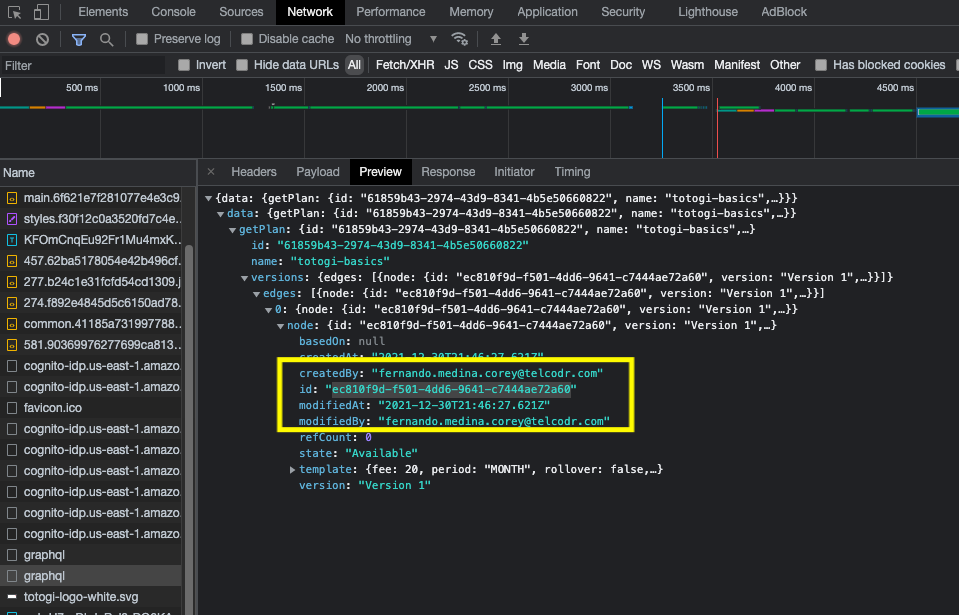
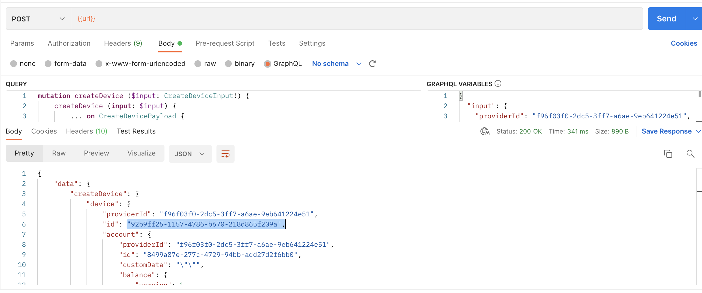

# Prerequisites and Required Software

- [Install The AWS CLI](https://docs.aws.amazon.com/cli/latest/userguide/getting-started-install.html)
- Obtain AWS CLI credentials for the AWS Account you are deploying to with 
- Configure those credentials to be used with `aws configure`
- [Install boto3](https://boto3.amazonaws.com/v1/documentation/api/latest/guide/quickstart.html)
- [Install Firefox](https://www.mozilla.org/en-US/firefox/new/)
- [Install Terraform](https://learn.hashicorp.com/tutorials/terraform/install-cli)
- [Install Node.js and NPM](https://nodejs.org/en/download/)
- Install Newman globally on your host with npm: `npm install -g newman`
- [Install `jq`](https://stedolan.github.io/jq/download/)
- [Install Certbot](https://eff-certbot.readthedocs.io/en/stable/install.html#alternate-installation-methods) to use locally with the `certonly` flag. 
  - Instructions [for Ubuntu](https://www.digitalocean.com/community/tutorials/how-to-use-certbot-standalone-mode-to-retrieve-let-s-encrypt-ssl-certificates-on-ubuntu-16-04)
  - Instructions for Mac: 
    - [Install Brew](https://brew.sh/)
    - And then certbot with Brew: `brew install certbot`
- [Install Vagrant](https://www.vagrantup.com/downloads)
- [Install VirtualBox](https://www.virtualbox.org/wiki/Downloads)
- Install `go@1.13` and `pyenv`
  - On Mac with Homebrew: `brew install go@1.13 pyenv`
  - Or with another package manager
- [Docker](https://www.docker.com/get-started)
- Docker Compose

Configure Go, and pyenv:

```bash
echo 'export PATH="/usr/local/opt/go@1.13/bin:$PATH"' >> ~/.zshrc
echo 'export PATH="/usr/local/opt/go@1.13/bin:$PATH"' >> ~/.zshrc
echo 'if command -v pyenv 1>/dev/null 2>&1; then eval "$(pyenv init -)"; fi' >> ~/.zshrc
exec $SHELL
pyenv install 3.7.3
pyenv global 3.7.3
```

Install other requirements:
```
pip3 install ansible fabric3 jsonpickle requests PyYAML
vagrant plugin install vagrant-vbguest
```

Build/Deploy installation requirements:

```bash
brew install aws-iam-authenticator kubectl helm terraform
```

If not on Mac use a different package manager to install these.

# Installing Magma

## Clone Git Repository

```bash
git clone https://github.com/trilogy-group/totogi.magma.git
cd totogi-magma
export MAGMA_ROOT=$(pwd)
```

## Set up variables

```bash
export YOUR_EMAIL="fernanado.medina.corey@telcodr.com"
export YOUR_ROOT_DOMAIN="totogidemo.com"
export YOUR_CA_DOMAIN="rootca.orc8r.totogidemo.com"
export YOUR_ORC8R_DOMAIN="orc8r.$YOUR_ROOT_DOMAIN"
export YOUR_ORC8R_DOMAIN_WILDCARD="*.orc8r.$YOUR_ROOT_DOMAIN"
export YOUR_ORC8R_NMS_DOMAIN_WILDCARD="*.nms.orc8r.$YOUR_ROOT_DOMAIN"
```

## Generating and Validating SSL Certificates

Create a certificate and the private key with certbot. This will require setting ACME challenge in a Route53 hosted zone. 

The step below generates the files `fullchain.pem` and `privkey.pem`.

```bash
certbot certonly --manual \
--preferred-challenges=dns \
--email $YOUR_EMAIL \
--server https://acme-v02.api.letsencrypt.org/directory \
--agree-tos 
-d $YOUR_CA_DOMAIN
-d $YOUR_ORC8R_DOMAIN_NO_WILDCARD

```


This will prompt you to deploy a DNS record for your domain with something like this:

```
Please deploy a DNS TXT record under the name:

_acme-challenge.orc8r.totogidemo.com.

with the following value:

fGaiP7x-WZjeNwu4ZhCiM_O3JS4HjSzGLMBLaPKHpNA

Before continuing, verify the TXT record has been deployed. Depending on the DNS
provider, this may take some time, from a few seconds to multiple minutes. You can
check if it has finished deploying with aid of online tools, such as the Google
Admin Toolbox: https://toolbox.googleapps.com/apps/dig/#TXT/_acme-challenge.orc8r.totogidemo.com.
Look for one or more bolded line(s) below the line ';ANSWER'. It should show the
value(s) you've just added.
```

Set these values as environment variables (use your values):

```bash
export CHALLENGE_TXT_DOMAIN="_acme-challenge.orc8r.totogidemo.com."
export CHALLENGE_TXT_VALUE="fGaiP7x-WZjeNwu4ZhCiM_O3JS4HjSzGLMBLaPKHpNA"
```

Also set your hosted zone ID as an environment variable:

```bash
export ROOT_HOSTED_ZONE_ID_LONG=`aws route53 list-hosted-zones-by-name \
--dns-name $YOUR_ROOT_DOMAIN \
--output text \
--query 'HostedZones[0].Id'`
export ROOT_HOSTED_ZONE_ID=${ROOT_HOSTED_ZONE_ID_LONG/\/hostedzone\//}
```

Then update the record sets with the ACME challenge:

```bash
export R53_BATCH_CHANGE_JSON='
  {
    "Changes": [{
      "Action"              : "CREATE"
      ,"ResourceRecordSet"  : {
        "Name"              : "'"$CHALLENGE_TXT_DOMAIN"'"
        ,"Type"             : "TXT"
        ,"TTL"              : 120
        ,"ResourceRecords"  : [{
            "Value"         : "\"'"$CHALLENGE_TXT_VALUE"'\""
        }]
      }
    }]
  }
  '
aws route53 change-resource-record-sets \
  --hosted-zone-id $ROOT_HOSTED_ZONE_ID \
  --change-batch $R53_BATCH_CHANGE_JSON
```

Check that the results show the text record
```bash
aws route53 list-resource-record-sets \
--hosted-zone-id $ROOT_HOSTED_ZONE_ID \
--query 'ResourceRecordSets[?Type==`TXT`]'
```


## Set up Certificates:

In order to setup your `certbot` certificates and get another required LetsEncrypt certificate you can run:

```bash
mkdir -p ~/secrets/certs -p
cd ~/secrets/certs
wget https://letsencrypt.org/certs/lets-encrypt-r3.pem
sudo cp /etc/letsencrypt/live/orc8r.totogidemo.com/fullchain.pem controller.crt
sudo cp /etc/letsencrypt/live/orc8r.totogidemo.com/privkey.pem controller.key
mv lets-encrypt-r3.pem rootCA.pem
```

This should should output certificates for you at `/etc/letsencrypt/live/orc8r.totogidemo.com/`. We also used `wget` to download the `lets-encrypt-r3.pem` file. For reference, that file and other LetsEncrypt certificates can be found [here](https://letsencrypt.org/certificates/). 

You may also need to Change permissions on your new `controller.key` file. This is highly permissive, only consider doing this on your local system:

```bash
sudo chmod 777 controller.key
```

Next, generate the remaining certificates with the `create_application_certs.sh` script:

```bash
${MAGMA_ROOT}/orc8r/cloud/deploy/scripts/create_application_certs.sh $YOUR_ORC8R_DOMAIN
openssl pkcs12 -export -inkey admin_operator.key.pem -in admin_operator.pem -out admin_operator.pfx
```

Also create the 'pfx' for REST API interaction (Swagger).

```bash
openssl pkcs12 -export -inkey admin_operator.key.pem -in admin_operator.pem -out admin_operator.pfx
```

You'll need to enter a password. 

Certificate files would look like this after the procedure under ~/secrets/certs.

```
controller.crt
controller.key
rootCA.pem
bootstrapper.key
fluentd.key
fluentd.pem
certifier.key
certifier.pem
admin_operator.key.pem
admin_operator.pem
```

Note - there is no `rootCA.key` unless you opt for a self-signed version of this process.

## Preparing the Terraform deployment

Edit the terrform file located at `${MAGMA_ROOT}/orc8r/cloud/deploy/terraform/orc8r-helm-aws/examples/basic/main.tf`

- Update the `region` in both modules to the region you're deploying into
- Update the `orc8r_domain_name` to the value of your domain name
- Add a custom `orc8r_db_password`
- Change the `orc8r_sns_email` to your email 

## Deploying with Terraform 

Then, deploy the root module with:

```bash
terraform apply -target=module.orc8r
```

It should output something like this:

```
Apply complete! Resources: 72 added, 0 changed, 0 destroyed.

Outputs:

nameservers = tolist([
  "ns-1002.awsdns-61.net",
  "ns-1376.awsdns-44.org",
  "ns-1619.awsdns-10.co.uk",
  "ns-304.awsdns-38.com",
])
```

After this initial deployment is done, copy the output Kube Config file locally to the correct location.

```bash
mkdir -p ~/.kube
cp kubeconfig_orc8r ~/.kube/config
```


Next, use Terraform to deploy the secrets to AWS:

```bash
terraform apply -target=module.orc8r-app.null_resource.orc8r_seed_secrets
```

Then run `terraform apply` to finish the deployment.

After the deployment completes, check on the Kubernetes cluster with:

```bash
kubectl get pods --all-namespaces
```

You should see a long list of running pods.

# Pod Orchestration

## Create the Orchestrator admin user:

```bash
export ORC_POD=$(kubectl --namespace orc8r get pod -l app.kubernetes.io/component=orchestrator -o jsonpath='{.items[0].metadata.name}')
kubectl --namespace orc8r exec ${ORC_POD} -- /var/opt/magma/bin/accessc add-existing -admin -cert /var/opt/magma/certs/admin_operator.pem admin_operator
```

Verify it was created:

```bash
kubectl --namespace orc8r exec ${ORC_POD} -- /var/opt/magma/bin/accessc list-certs
```

## Create an NMS user for the 'master' organization

Get the name of the NMS Pod and set it as an env variable:

```bash
export NMS_POD=$(kubectl --namespace orc8r get pod -l  app.kubernetes.io/component=magmalte -o jsonpath='{.items[0].metadata.name}')
```

Replace `ADMIN_USER_EMAIL` and `ADMIN_USER_PASSWORD` values in the command below with user and password values to be used.

```bash
kubectl --namespace orc8r exec -it ${NMS_POD} -- yarn setAdminPassword master ADMIN_USER_EMAIL ADMIN_USER_PASSWORD
```


# DNS Resolution

Assuming that the Route 53 Hosted Zone for the main domain (e.g. totogidemo.com) already exists, we need to add the name servers for the newly created subdomain (orc8r.totogidemo.com) in this example to the already existing Route 53 hosted zone.

Navigate to the same directory as the `main.tf` file: `${MAGMA_ROOT}/orc8r/cloud/deploy/terraform/orc8r-helm-aws/examples/basic/main.tf`

Then run: `terraform output`

You should see something like this:

```js
nameservers = tolist([
  "ns-1405.awsdns-47.org",
  "ns-1746.awsdns-26.co.uk",
  "ns-201.awsdns-25.com",
  "ns-695.awsdns-22.net",
])
```

Next, add the values you see to the main Route 53 main hosted zone (e.g. totogidemo.com):

```bash
export NAMESERVERS_JSON=$(terraform output -json nameservers | jq '[{Value: .[]}]')
export R53_BATCH_CHANGE_JSON='
  {
    "Changes": [{
      "Action"              : "CREATE"
      ,"ResourceRecordSet"  : {
        "Name"              : "'"$YOUR_ORC8R_DOMAIN_NO_WILDCARD"'"
        ,"Type"             : "NS"
        ,"TTL"              : 120
        ,"ResourceRecords"  : '"$NAMESERVERS_JSON"'
      }
    }]
  }
  '
aws route53 change-resource-record-sets \
  --hosted-zone-id $ROOT_HOSTED_ZONE_ID \
  --change-batch $R53_BATCH_CHANGE_JSON
```


Check that the results show the NS records
```bash
aws route53 list-resource-record-sets \
--hosted-zone-id $ROOT_HOSTED_ZONE_ID \
--query 'ResourceRecordSets[?Type==`NS`]'
```

## Connecting to Magma Infrastructure

### The NMS UI

After this point, NMS UI can be reached via: https://master.nms.orc8r.totogidemo.com/

### The Swagger UI

To access the Swagger UI you will need to set a PFX certificate in your browser. For this, we're using Firefox.

- Open Firefox and navigate to: `about:preferences` or go to the settings tab through the Firefox menus
- Search for "Certificates" and click "View Certificates"
- Select the "Your Certificates Tab" if it isn't already selected
- Select "Import"
- Enter in the required password for the PFX you set earlier
- Find the `admin_operator.pfx` file in `~/secrets/certs` and select it for import
- Navigate to `https://api.orc8r.totogidemo.com/swagger/v1/ui/`
- Accept the prompt if presented with one

It should look like a typical SwaggerUI with the title of "Magma"

# Installing the AGW as a local VM

- Go to the Gateway portion of the code: `cd ${MAGMA_ROOT}/lte/gateway`
- Run `vagrant up magma`
- If you see an error regarding allowed IP address ranges for the host-only network you will need to:
  - Create or edit the `/etc/vbox/networks.conf` file 
  - Run: `sudo mkdir -p /etc/vbox && echo "* 192.168.0.0/16" | sudo tee /etc/vbox/networks.conf`
  - This is due to a recent (~Nov 2021) change in VirtualBox [described here](https://forums.virtualbox.org/viewtopic.php?f=8&t=104549)

## Build the AGW from Source in the VM

From the corresponding OS and directory run the shown commands:

```
HOST [magma/lte/gateway]$ vagrant ssh magma
MAGMA-VM [/home/vagrant]$ cd magma/lte/gateway
MAGMA-VM [/home/vagrant/magma/lte/gateway]$ make run
```

If you encounter errors with this process then `exit` out to the host and run `vagrant provision magma` in the host environment for more debugging information.

If you see an issue about an untrusted release file [like this](https://github.com/fluent/fluent-bit/issues/4180) then just try the same commands again: 

```
HOST [magma/lte/gateway]$ vagrant ssh magma
MAGMA-VM [/home/vagrant]$ cd magma/lte/gateway
MAGMA-VM [/home/vagrant/magma/lte/gateway]$ make run
```

Check the relevant Magma services are running with:

- `service magma@* status`

At this point, we need to get the HW UUID of the AGW instance to be registered on the NMS.

- Elevate to root: `sudo su`
- And then run `show_gateway_info.py`

The command above should already be in the $PATH at `/home/vagrant/build/python/bin/show_gateway_info.py`

This should output something like this:

```
Hardware ID
-----------
7fe45b5e-62d2-4e16-8774-1955565e70e1

Challenge key
-------------
MHYwEAYHKoZIzj0CAQYFK4EEACIDYgAE9h0eluqkSJsbysbxR8rzxSTadWCqdeEtLnfnf5dH1amAUAzw/jHiPrKl2n/0G2IPzytp6Nwnvmq/N5EEmUEX8aIJZisDRp2zWfhfnhlqJ5Gg+y/ujirwpYq2S9f9hr+/

Notes
-----
- Hardware ID is this gateway's unique identifier
- Challenge key is this gateway's long-term keypair used for
  bootstrapping a secure connection to the cloud
```

## Configure the AGW with the Orchestrator using the NMS UI

Once the AGW is installed and running it will have default configuration, and will not be able to "checkin" to the Orc8r. The gateway needs to be defined in the Orc8r cloud first in order for this to work.

To do this, start by visiting the "master" node for the https://master.nms.orc8r.totogidemo.com/. 

Then, under the master node create a new organization: https://master.nms.orc8r.totogidemo.com/master/organizations/new
  - The organization should have access to the NMS tab
  - The organization should have "Enable all networks" checked

Once the organization is created, create a user for it as well with the role ‘Super User’.

Then log on to the organization’s NMS page, if the organization name is `myagw` then following would be the URL: https://myagw.nms.orc8r.totogidemo.com/ 

After you are signed in with your new super user, the next step is to create a network.

- Click "Add Network"
- Network ID: `localagwnet`
- Name: `localagwnet` 
- Description: `localagwnet`
- Type: of type `lte`

After creating the network refresh the page. You should now see an "Equipment" section on the left.

localagwnet

At this point the ‘Equipment’ tab should be available on the left sidebar. Gateway instance needs to be added from here by clicking on the ‘Add New’ button. The ‘Hardware UUID’ and ‘Challenge Key’ values need to come from the earlier output printed by the ‘show_gateway_info.py’ script. Once the ‘Save And Continue’ button is clicked on the 1st page of the modal dialog, the gateway instance will be created. Rest of the configuration can be left by clicking on the ‘Cancel’ button.

## Configure the AGW to Connect to the Orchestrator from the AGW VM

Make sure you are in the AGW VM and then take the following steps:

- First, stop the AGW services with `service magma@* stop`
- Then, create a new directory for the magma configs `mkdir -p /var/opt/magma/configs` ls
- Then edit the file at `/home/vagrant/magma/lte/gateway/configs/control_proxy.yml` to the following (changing values as needed for the totogi.com domain):

```yml
cloud_address: controller.orc8r.totogidemo.com
cloud_port: 443
bootstrap_address: bootstrapper-controller.orc8r.totogidemo.com
bootstrap_port: 443
fluentd_address: fluentd.orc8r.totogidemo.com
fluentd_port: 24224
rootca_cert: /var/opt/magma/tmp/certs/rootCA.pem
```

After it's edited, copy it to a new location:

- `cp /home/vagrant/magma/lte/gateway/configs/control_proxy.yml /var/opt/magma/configs/control_proxy.yml`

Delete the current contents of the AGW Magma certs directory and create a new file:

- `rm /var/opt/magma/certs/*`
- `touch /var/opt/magma/certs/rootCA.pem`

Copy the contents of `~/secrets/certs/rootCA.pem` on the *host machine* to this `rootCA.pem` on the guest.

Restart the services on the AGW: 

- `service magma@magmad restart`
- `journalctl -u magma@magmad -f`

## Connecting the local AGW to the Cloud-based Orchestrator

https://docs.magmacore.org/docs/lte/deploy_config_agw

## Connecting to Totogi Charging System

### Create Your Tenant

The Totogi Charing system requires you to have your own tenant in order to send requests from your Magma infrastructure to Totogi. At the moment this process is fairly manual.

The overall process is described [here](https://docs.google.com/document/d/1bxfXMg6BF7zp8mBqU2RFo433eqH1SLpucO77iaRfkmE/edit?hl=en&forcehl=1#) but you may need to take additional steps if you lack access to the production Totogi OCS account.

Start by providing data to create your tenant:

[{
  "commonName": "<YOUR_COMMON_NAME>",
  "configurationAdminUsername": "fernando.medina.corey@telcodr.com",
  "infraUsername": "fernando.medina.corey@telcodr.com",
  "deviceAdminUsername": "fernando.medina.corey@telcodr.com"
}]

The values you need will be: 
- `commonName`: This is the common name of the `rootCA.pem` certificate you are using on your orchestrator that will also be used to authentic traffic to Totogi.
- `configurationAdminUsername` - an email address that you will use to sign into `plan.totogi.com`. 
- `infraUsername` - an email address that you will use to get a JWT to make HTTP API request to the charging API
- `deviceAdminUsername` - an email address that you will use to generate a JWT in order to make API requests to create Accounts and devices

The three usernames can be the same or different. After creating this payload if you have production access to can use a Lambda function mentioned in the earlier document to generate your credentials and then retrieve them from the AWS secrets manager. Otherwise, you will need to send this payload to Federico Benitez (federico.benitez@aurea.com) in the "TelcoDR Eng-BU" space in order to have the tenant created for you.

This process may change later.

### Create Your First Totogi Plan

When you have the username and password for all these accounts start by logging into the plan.totogi.com UI. We could do some of these actions using the APIs but it would be more difficult.

First, set up general information under the settings Menu (the gear on the left). An example configuration:

- General - 1s for everything
- Overage - 1s for everything
- Off-peak Time - Sun 12am to 5am

Now create a new plan with the +Plan button and pressing "New Plan". 

- Plan Name: `totogi-basics`
- Price: $20 Monthly

From the Features search and dropdown find:

- Voice: Unlimited
- Text: 200 messages

Then click "Save".

After this, we need to publish our plan so visit back into the plan and click the dropdown to publish it.

When finished, you should see the Plan ID GUID in the URL. For example with the URL of:

- `https://www.plan.totogi.com/plans/61859b43-2974-43d9-8341-4b5e50660822`
- The GUID is `61859b43-2974-43d9-8341-4b5e50660822`

After the plan is published you can also grab the Plan version ID from opening the console network tab and reviewing the GraphQL requests after refreshing the page.



We could also get this value through the APIs but this is easier. 

### Create the Subscriber Account and Device

Start by creating a file called `aws-auth-data.json` that contains the following structure:

```
{
   "AuthParameters" : {
      "USERNAME" : "fernando.medina.corey@telcodr.com",
      "PASSWORD" : "WuFguk^9|:"
   },
   "AuthFlow" : "USER_PASSWORD_AUTH",
   "ClientId" : "3bsr3p2j5ffn1cf05knuqc03v2"
}
```

- USERNAME is the deviceAdmin username (in this case fernando.medina.corey@telcodr.com)
- PASSWORD is the deviceAdmin password
Client ID is a static identifier.

Then run this command to get the ID token you'll need to authorize requests:

```bash
curl -X POST --data @aws-auth-data.json \
-H 'X-Amz-Target: AWSCognitoIdentityProviderService.InitiateAuth' \
-H 'Content-Type: application/x-amz-json-1.1' https://cognito-idp.us-east-1.amazonaws.com/us-east-1_ivnC5IUbA/ | jq '.AuthenticationResult.IdToken' 
```

Next, we can add an account and device. I suggest creating a Postman Collection from the [GraphQL Schema](https://drive.google.com/file/d/1qpmlbGptgARJp6P8rJhI7wwpzJYlaHKF/view?usp=sharing). 

**Create the Account**

Make the following changes:

1. Copy the production URL `https://4c3mrbifgveqpkxnni5fcjhjwi.appsync-api.us-east-1.amazonaws.com/graphql` and edit the collection's variables to include it as the `url` variable.

2. Then, open up the `mutations` folder and go to `createAccount` and update the GraphQL Variables section on the right side with this:
    ```json
    {
      "input": {
        "providerId": "f96f03f0-2dc5-3ff7-a6ae-9eb641224e51"
      }
    }
    ```
    Use the provider ID of the tenant you're working under. 

3. Then, go to the "Headers" section and add an "Authorization" header with the value of the unquoted IdToken output from the earlier curl command. **NOTE:** This does not include the standard `Bearer` prefix.
4. Go to the "Authorization" section of the request and set it to "No Auth" (as we'll be handling that manually from the Headers)
5. Then send the postman request and record the accountId in the response.

**Create the Device**

1. Go to the `createDevice` mutation and edit the GraphQL variables so that they include your providerId and your recently-created accountId like this:
    ```json
    {
      "input": {
        "providerId": "f96f03f0-2dc5-3ff7-a6ae-9eb641224e51",
        "accountId": "8499a87e-277c-4729-94bb-add27d2f6bb0"
      }
    }
    ```
2. Add the same `Authorization` header
3. In the "Authorization" section set it to "No Auth"
4. Send the request and record the deviceId in the response:
    

### Subscribe the Account to the Plan

1. Go to the `subscribeToPlan` mutation and set the Authorizer header as the idToken value as before.
2. Go to the "Authorization" section and set "No Auth" as before
3. Fill out the GraphQL variables using your earlier obtained values:
    ```json
    {
      "input": {
        "providerId": "f96f03f0-2dc5-3ff7-a6ae-9eb641224e51",
        "accountId": "8499a87e-277c-4729-94bb-add27d2f6bb0",
        "planVersionId": "ec810f9d-f501-4dd6-9641-c7444ae72a60"
      }
    }
    ```

If the request succeeds then your account should now be subscribed to the plan!

### Top up the Account

Modify your `aws-auth-data.json` file (or create a new one) so that it contains the following structure:

```json
{
   "AuthParameters" : {
      "USERNAME" : "fernando.medina.corey@telcodr.com",
      "PASSWORD" : "3ndE!db=ZF"
   },
   "AuthFlow" : "USER_PASSWORD_AUTH",
   "ClientId" : "3bsr3ps2j5ffn1cf05knuqc03v2"
}
```

USERNAME - This time the username should be the Infrastructure Admin username
PASSWORD - The Infrastructure Admin Password


```bash
export ID_TOKEN=$(curl -X POST --data @aws-auth-data.json \
-H 'X-Amz-Target: AWSCognitoIdentityProviderService.InitiateAuth' \
-H 'Content-Type: application/x-amz-json-1.1' https://cognito-idp.us-east-1.amazonaws.com/us-east-1_ivnC5IUbA/ | jq -r '.AuthenticationResult.IdToken')
```


```bash
curl -X POST -H "Content-Type: application/json" -H "Authorization:Bearer $ID_TOKEN" -d @credit-request.json https://lb0prod.dev.ccab.devfactory.com/nchf-convergedcharging/v3/chargingData
```

With the account created we can now add a device.

## Testing Your AGW and Orc8r with srsRAN

In order to confirm that AGW, Orc8r, and NMS are all set up correctly then follow [this demo](https://github.com/ShubhamTatvamasi/srsRAN-demo) to test a virtualized UE and eNB. 

After your local srsRAN VM is setup you can also use it to test end to end with the FeG.

## Testing Your Certificates and Connection to Totogi with the FeG gy Client

In order to make sure that your FeG will be able to connect to Totogi as expected, you can build the FeG gy CLI client following the instructions [laid out here](https://docs.google.com/document/d/1cOPrPYzgVc4PNXhGYRVLVSKq8uj-stivyGYGnEo26tI/edit)

Note that the IP address used in the document changes regularly and may need to be updated.


When the FeG is built you can set up environment variables (replace the values as needed, especially for your local certificates if running locally):

```bash
export OCS_ADDR=44.197.233.169:3868
export OCS_TLS_CERT_FILE=/Users/fernando/Desktop/certbot-test-for-feg-rootca-domain/rootca.orc8r/fullchain.pem
export OCS_TLS_KEY_FILE=/Users/fernando/Desktop/certbot-test-for-feg-rootca-domain/rootca.orc8r/privkey.pem
export GY_DIAM_HOST=rootca.orc8r.totogidemo.com
export GY_DIAM_REALM=orc8r.totogidemo.com
export OCS_HOST=ocs.totogi.com
export OCS_REALM=totogi.com
```

And with the variables configured, then run a command to trigger Diameter charging requests:

```bash
./gy_client_cli --commands=IUT \
--rating_groups=2 \
--msisdn=$DEVICE_ID \
--imsi= --requestedUnitsTotal=8 \
--used_credit=2
```

# Changelog

- Updated `orc8r/gateway/python/setup.py` to bump the redis version the AGW builds with. It was causing a mismatch error described [here](https://github.com/magma/magma/issues/10461) and [solved here](https://github.com/magma/magma/pull/10462/files)

# Misc. Notes

When creating a tenant/provider with a wildcard certificate e.g.:
*.orc8r.totogidemo.com

You must explicitly match those same certificates

Also, when creating a non-wildcard subdomain under the orc8r e.g.:

rootca.orc8r.totogidemo.com

If you are creating the certificates after creating the new hosted zone for the orc8r then you must add the txt records directly to the orc8r hosted zone.

## Previously provisioned plans you can test with (May have been cleaned out by Eng recently):

Provider/Tenant details:

```yaml
provider id: f96f03f0-2dc5-3ff7-a6ae-9eb641224e51
provider root cert domain: rootca.orc8r.totogidemo.com
```

**TOTOGI LIMITED (PLENTY) PLAN**:

This plan has limited minute/sms/data allocations but has a lot of capacity.

```yaml
Plan "totogi-limited-plenty": e1e9649e-a41e-454d-9839-13ba0b9dce3e
Plan Version Id - Version 1: 682d38fd-2341-469b-9690-1223abdb6f0d
New Account ID: a946c8bc-0d28-4bde-9cc7-9dee0f9dddbc
New Device ID: 001012333444555
```

TOTOGI UNLIMITED PLAN:
This plan had some unlimited services. 

```yaml
Plan "totogi-unlimited": 088bf69f-5e01-4d7e-9cfa-414068b4f8e5
Plan version 1: 17d6c4c6-8f45-4b65-ba1c-b0dcf45e405a
New account ID: 467beced-ccdf-4e45-a9b8-a8fa84f87108
New Device ID: bcc7f3b5-3608-4eba-96dc-41be3cc665d1
```

You can check on these or create new ones [in the UI](https://www.plan.totogi.com/settings).
Username: fernando.medina.corey@telcodr.com
Password: Ask Fernando


export OCS_ADDR=44.197.233.169:3868
export OCS_TLS_CERT_FILE=/Users/fernando/Desktop/certbot-test-for-feg-rootca-domain/rootca.orc8r/fullchain.pem
export OCS_TLS_KEY_FILE=/Users/fernando/Desktop/certbot-test-for-feg-rootca-domain/rootca.orc8r/privkey.pem
export GY_DIAM_HOST=rootca.orc8r.totogidemo.com
export GY_DIAM_REALM=orc8r.totogidemo.com
export OCS_HOST=ocs.totogi.com
export OCS_REALM=totogi.com
export DEVICE_ID="bcc7f3b5-3608-4eba-96dc-41be3cc665d1"


## Orc8r Commands you might need to run in order to change things within the orc8r:

Delete old secrets:
```bash
kubectl delete secret fluentd-certs nms-certs orc8r-certs -n orc8r
```

Create new secrets:

```bash
kubectl -n orc8r create secret generic fluentd-certs \
  --from-file=certifier.pem \
  --from-file=fluentd.pem \
  --from-file=fluentd.key

kubectl -n orc8r create secret generic nms-certs \
  --from-file=admin_operator.key.pem \
  --from-file=admin_operator.pem \
  --from-file=controller.crt \
  --from-file=controller.key

kubectl -n orc8r create secret generic orc8r-certs \
  --from-file=admin_operator.pem \
  --from-file=bootstrapper.key \
  --from-file=certifier.key \
  --from-file=certifier.pem \
  --from-file=controller.crt \
  --from-file=controller.key \
  --from-file=rootCA.pem \
  --from-file=rootCA.key
```

Getting the Orc8r pod and updating the cert on it (If you need to change the certs)

```bash
ORC_POD=$(kubectl -n orc8r get pod -l app.kubernetes.io/component=orchestrator -o jsonpath='{.items[0].metadata.name}')
kubectl -n orc8r exec -it ${ORC_POD} -- envdir /var/opt/magma/envdir /var/opt/magma/bin/accessc \
  add-existing -admin -cert /var/opt/magma/certs/admin_operator.pem admin_operator
```

Forcing new orc8r pods to update to the new secrets (when they spins back up they will have the secrets):

```bash
kubectl delete pods --all -n orc8r
```

# Regeneration of Certificates
If your AGW is unable to connect to orc8r, there is a debugging script `checkin_cli.py` in AGW and FEG which diagnosis the cause.
```bash
[AGW]$ sudo su
[AGW]$ checkin_cli.py
``` 
If it says that certificates are expired, we can regenrate the certs and update on all platforms. The process is as follows:
## 1. Generate Certificates using Certbot
```bash
export MAGMA_ROOT=$(pwd)
export YOUR_EMAIL="abdullah.ashfaq@totogi.com"
export YOUR_ROOT_DOMAIN=totogidemo.com
export YOUR_CA_DOMAIN="rootca.orc8r.totogidemo.com"
export YOUR_ORC8R_DOMAIN="orc8r.$YOUR_ROOT_DOMAIN"
export YOUR_ORC8R_DOMAIN_WILDCARD="*.orc8r.$YOUR_ROOT_DOMAIN"
export YOUR_ORC8R_DOMAIN_NO_WILDCARD="orc8r.$YOUR_ROOT_DOMAIN"
export YOUR_ORC8R_NMS_DOMAIN_WILDCARD="*.nms.orc8r.$YOUR_ROOT_DOMAIN"

sudo certbot certonly --manual --preferred-challenges=dns --email $YOUR_EMAIL --server https://acme-v02.api.letsencrypt.org/directory --agree-tos 
-d $YOUR_CA_DOMAIN 
-d $YOUR_ORC8R_DOMAIN_NO_WILDCARD 
-d $YOUR_ORC8R_NMS_DOMAIN_WILDCARD 
-d api.orc8r.totogidemo.com 
-d controller.orc8r.totogidemo.com 
-d bootstrapper-controller.orc8r.totogidemo.com 
-d fluentd.orc8r.totogidemo.com
# This command will pause and ask to update TXT on route53. 
# Continue only after updating the TXT and it will generate certs in /etc/letsencrypt/live/yourdomain.com/ if successful
``` 
Then follow the steps mentioned in `Set up Certificates:` section above to get certs in ~/secrets/certs

## 2. Update on Secrets Manager
Use terraform to update the secrets. The  complete guide can be found [here](https://docs.magmacore.org/docs/howtos/troubleshooting/update_certificates). But sometimes `terraform apply` fails so we run targetted apply statements
```bash
terraform taint module.orc8r-app.null_resource.orc8r_seed_secrets
terraform apply -target=module.orc8r-app.null_resource.orc8r_seed_secrets
```

## 3. Restarting Orc8r
Kill the pods and they will restart again using the new certs from secret manager. Some useful commands [here](https://github.com/ShubhamTatvamasi/magma-aws/blob/master/docs/get-aws-certs.md). 
```bash

# Change namespace to orc8r to avoid -n orc8r in every kubectl command
kubectl config set-context --current --namespace orc8r

# delete old certificates:
kubectl delete secret fluentd-certs nms-certs orc8r-certs

#create Orc8r secrets from files:
kubectl create secret generic fluentd-certs \
  --from-file=certifier.pem \
  --from-file=fluentd.pem \
  --from-file=fluentd.key

kubectl create secret generic nms-certs \
  --from-file=admin_operator.key.pem \
  --from-file=admin_operator.pem \
  --from-file=controller.crt \
  --from-file=controller.key

kubectl create secret generic orc8r-certs \
  --from-file=admin_operator.pem \
  --from-file=bootstrapper.key \
  --from-file=certifier.key \
  --from-file=certifier.pem \
  --from-file=controller.crt \
  --from-file=controller.key \
  --from-file=rootCA.pem

# Run this statement before killing
ORC_POD=$(kubectl -n orc8r get pod -l app.kubernetes.io/component=orchestrator -o jsonpath='{.items[0].metadata.name}')
kubectl -n orc8r exec -it ${ORC_POD} -- envdir /var/opt/magma/envdir /var/opt/magma/bin/accessc \
  add-existing -admin -cert /var/opt/magma/certs/admin_operator.pem admin_operator

# Now destroy all orc8r pods
kubectl delete pods --all -n orc8r

# After destroying they will relaunch themselves. To get their status run
kubectl get pod

```

# Adding New Users to the k8s Cluster:

1. Add the user in the AWS account as an IAM user and give them their AWS Access keys
2. The user must set up their AWS CLI locally with those creds
3. Take the ARN of the user and save it for later
4. Add a user to the k8s aws-auth config by running `kubectl edit configmap aws-auth -n kube-system`

And then edit the file this brings up in the terminal. This is an example of the file with multiple users, just add the new user with their AWS ARN and a new k8s username (can be the same or different as the AWS user name):

```yml
# Please edit the object below. Lines beginning with a '#' will be ignored,
# and an empty file will abort the edit. If an error occurs while saving this file will be
# reopened with the relevant failures.
#
apiVersion: v1
data:
  mapAccounts: |
    []
  mapRoles: |
    - "groups":
      - "system:bootstrappers"
      - "system:nodes"
      "rolearn": "arn:aws:iam::617147411452:role/orc8r20211225011717787500000001"
      "username": "system:node:{{EC2PrivateDNSName}}"
  mapUsers: |
    - userarn: arn:aws:iam::617147411452:user/abdullah.ashfaq
      username: abdullah
      groups:
        - system:masters
    - userarn: arn:aws:iam::617147411452:user/michael.selig
      username: michaelselig
      groups:
        - system:masters
kind: ConfigMap
metadata:
  creationTimestamp: "2021-12-25T01:17:22Z"
  labels:
    app.kubernetes.io/managed-by: Terraform
    terraform.io/module: terraform-aws-modules.eks.aws
  managedFields:
  - apiVersion: v1
    fieldsType: FieldsV1
    fieldsV1:
      f:data:
        .: {}
        f:mapAccounts: {}
        f:mapRoles: {}
      f:metadata:
        f:labels:
          .: {}
          f:app.kubernetes.io/managed-by: {}
          f:terraform.io/module: {}
    manager: HashiCorp
    operation: Update
    time: "2021-12-25T01:17:22Z"
  - apiVersion: v1
    fieldsType: FieldsV1
    fieldsV1:
      f:data:
        f:mapUsers: {}
    manager: kubectl
    operation: Update
    time: "2022-02-07T15:30:56Z"
  name: aws-auth
  namespace: kube-system
  resourceVersion: "13055663"
  selfLink: /api/v1/namespaces/kube-system/configmaps/aws-auth
  uid: 1f4b10df-6deb-4cd6-b431-44247595e61b
```

You can check that the user has been added after saving the file by running this:

- `kubectl describe configmap -n kube-system aws-auth`

5. After the user is added the new user should set up a Kube Config file using the maual process described [here](https://docs.aws.amazon.com/eks/latest/userguide/create-kubeconfig.html). The relevant required values required are `us-west-2` and `orc8r`. 


**TODOs:**

- Test this existing new streamlined deployment process in a new AWS account
- Explore cloudstrapper deployment of Orchestrator - [blog post](https://aws.amazon.com/blogs/industries/deploying-magma-on-aws-cloud-in-region-on-premises-and-at-edge/)
- Explore cloudstrapper deployment of AGW (Region deployment) - [blog post](https://aws.amazon.com/blogs/industries/deploying-magma-on-aws-cloud-in-region-on-premises-and-at-edge/)
- Consider replacing the certbot step with AWS Certificate Manager
- Investigate privacy error related to sub subdomains (Seem to be missing SANs we could add during the certificate creation process with certbot using an extra set of domains with -d flags). E.g. The SSL Cert is issued for *.orc8r.totogidemo.com not *.nms.orc8r.totogidemo.com which may be the issue.


- Hooks for first issue with certbot. Something like this:
  ```bash
  certbot certonly \
    --config-dir `pwd`/etc/letsencrypt \
    --work-dir `pwd`/var/lib/letsencrypt \
    --logs-dir `pwd`/var/log \
    --manual --preferred-challenges dns \
    --manual-auth-hook `pwd`/etc/letsencrypt/renewal-hooks/auth/manual-auth-hook.sh
  ```

  And then this is `manual-auth-hook.sh`:

  ```bash
  #!/bin/bash

  ROUTE53_ZONE=xxxxxxxxxxxxxx
  ACME_HOSTNAME="_acme-challenge.${CERTBOT_DOMAIN}"

  echo "Adding TXT record \"${CERTBOT_VALIDATION}\" for ${ACME_HOSTNAME} ..."
  aws route53 change-resource-record-sets \
      --hosted-zone-id ${ROUTE53_ZONE} \
      --change-batch "{\"Changes\":[{\"Action\":\"UPSERT\",\"ResourceRecordSet\":{\"Name\":\"${ACME_HOSTNAME}\",\"Type\":\"TXT\",\"TTL\":30,\"ResourceRecords\":[{\"Value\": \"\\\"${CERTBOT_VALIDATION}\\\"\"}]}}]}"
  sleep 15

  TXT_VALUE="$(dig -t txt "${ACME_HOSTNAME}" | sed -n "s/^${ACME_HOSTNAME}.*\"\(.*\)\"/\1/p")"
  while [[ "${TXT_VALUE}" != "${CERTBOT_VALIDATION}" ]]; do
      echo "Current TXT value '${TXT_VALUE}' does not match '${CERTBOT_VALIDATION}'. Wait 5 seconds before retry ..."
      sleep 5
      TXT_VALUE="$(dig -t txt "${ACME_HOSTNAME}" | sed -n "s/^${ACME_HOSTNAME}.*\"\(.*\)\"/\1/p")"
  done
  ```

- Hook for renewal
  ```bash
  #!/bin/bash

  certbot renew \
      --config-dir `pwd`/etc/letsencrypt \
      --work-dir `pwd`/var/lib/letsencrypt \
      --logs-dir `pwd`/var/log \
      --manual-auth-hook `pwd`/etc/letsencrypt/renewal-hooks/auth/manual-auth-hook.sh
  ```

  Would have to figure out where this runs. Can lambda run this with bash and the CLI? Translate this into Python and run regularly there instead? Does Certbot have a Python client? Can we use the same flags and output variables like txt value which we need to put into the DNS?